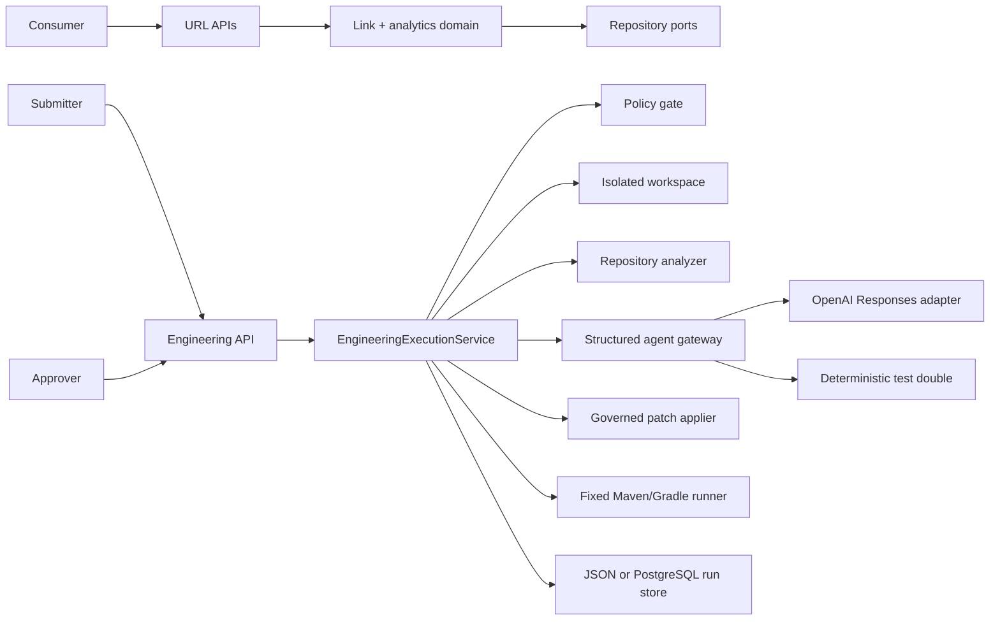
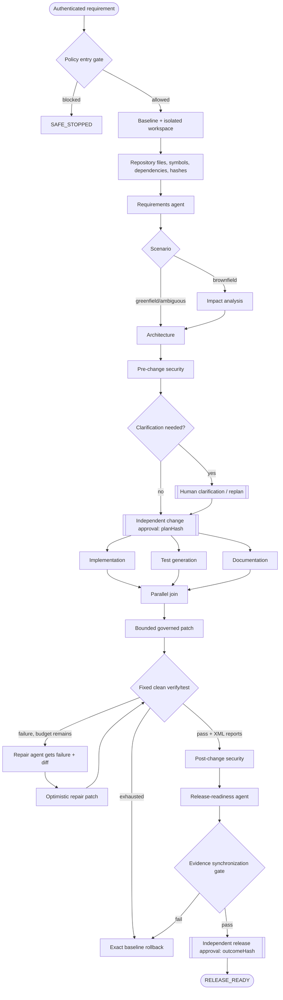

# Architecture and execution control

## System context

The repository contains two bounded capabilities: a working URL-shortening product and a governed
engineering system that can propose and validate changes to a repository. They share Spring Boot,
security, error handling, configuration and observability, but their domain services are separate.

## Explicit dependency graph

The primary graph is encoded by orchestration state plus declared role dependencies. Its entry and
exit gates are enforced in code, not delegated to a model.

The three change branches execute on a bounded pool. Each invocation records provider, model,
prompt version, timestamps, latency, token counts when available, response status, input/output
hashes and structured output. The join cannot proceed until all branches finish within the model
timeout.

## State and evidence

`EngineeringRun` is the aggregate and the sole transition authority. A run records:

- requirement, scenario, submitter, baseline revision and monotonic revision;
- repository map and baseline/workspace manifest hashes;
- every agent invocation and its decision lineage;
- proposed/applied operations, unified diff and per-artifact hashes;
- fixed command, exit code, duration, parsed test results and test-report hashes;
- change/release approvals bound to exact artifact hashes;
- validation, rollback evidence and a SHA-256 hash-chained audit trail.

Every API projection recomputes the complete audit chain and exposes `auditChainValid`; requirements
and operator reasons are redacted before durable storage, while policy evaluation still inspects the
original inbound requirement.

Durable file writes use temporary-file replacement. The PostgreSQL adapter creates a run table and
atomically upserts the serialized aggregate. In-process locks serialize concurrent changes to a run;
production multi-worker execution would add a database version column and lease/heartbeat claims.

## Repository reasoning and safe mutation

`RepositoryWorkspaceService` accepts `WORKING_TREE` or a validated named Git revision. It creates
separate baseline and working copies, rejects traversal/symlinks, excludes `.git` and generated
directories, and enforces file/byte limits. `RepositoryAnalyzer` derives build system, files,
source/test locations, packages, types, methods, dependencies, requirement-relevant snippets and
hashes from the selected snapshot.

The LLM never receives a shell tool. `GovernedPatchApplier` accepts only typed create/update/delete
operations, confines paths to the workspace, protects build/workflow/VCS files, checks optimistic
hashes for changes, scans generated content for secrets and applies size/count limits. Validation is
the only process-spawning layer and chooses from fixed Maven/Gradle commands; model text cannot
influence the command or arguments.

## Gates and separation of duties

| Gate | Entry evidence | Exit rule |
|---|---|---|
| Policy | raw requirement | no blocking secret, destructive or governance-bypass intent |
| Clarification | ambiguous plan | submitter revises requirement in a new revision |
| Change approval | repository map + agent outputs + `planHash` | authenticated approver, not submitter, supplies exact hash |
| Patch | typed file operations | paths/content/hashes pass policy and patch is applied atomically |
| Build | changed manifest | fixed process exits zero, executes tests and produces hashed XML reports |
| Quality | current patch/build/security/release evidence | all evidence belongs to current plan and manifest |
| Release approval | `outcomeHash` | independent approver supplies exact hash; no deployment occurs |

Authentication identity comes from Spring Security, never from request-body actor/approver fields.
The local users exist only for demonstration and are environment-configurable.

## Retry, fallback, rollback and safe stop

- Agent and build calls have bounded timeouts; outputs and contexts are bounded.
- Build/repair runs at most `AGENTIC_MAX_ATTEMPTS` (hard-capped at five, default three).
- A repair receives the actual build output, current diff and refreshed repository hashes. An empty,
  invalid or stale repair restores the baseline instead of being accepted.
- There is no fabricated-success fallback. Provider outages, schema errors and unsafe output lead to
  safe stop and rollback.
- Rollback replaces the workspace from the immutable baseline and verifies the restored manifest.
- Cancellation uses the same compensating path.

## Dynamic replanning

An accepted upstream change increments the revision, records actor/reason, restores the old
workspace, clears current plan/outcome/patch/validation, builds a fresh workspace and repository map,
then reruns planning. Historical invocations and approvals remain revision-tagged for lineage, while
their exact hashes cannot authorize the revised plan or outcome.

## Observability and scale path

The API exposes success rate, safe-stop/failure count, retry count, rollback count, mean recovery
time and mean end-to-end latency. Actuator provides health and Prometheus endpoints. Audit events
contain sequence, timestamp, actor, details, previous hash and event hash.
The run view also reports whether every sequence, previous-hash link and event digest verifies.

For production: use managed PostgreSQL with optimistic versioning, append/signed audit export,
OIDC/RBAC identities, durable workers with leases, ephemeral sandbox containers, an allow-listed
egress proxy, secret-manager injection, Redis for hot redirects and a durable event stream for exact
analytics. The ports and evidence model keep these substitutions outside core policy/state logic.
